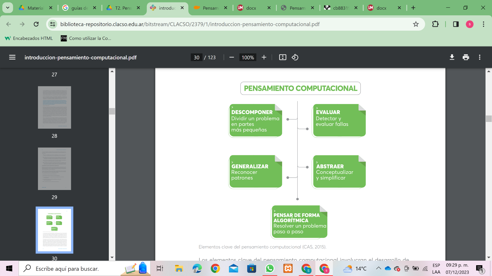
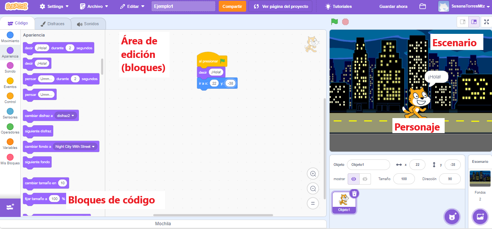
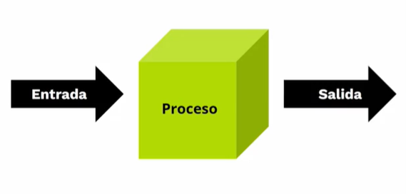
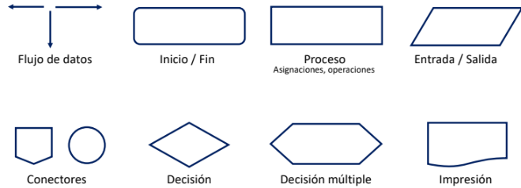
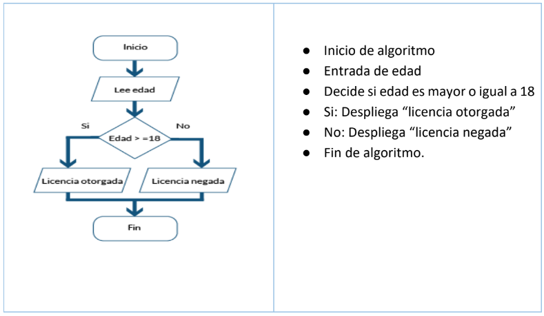

### Pensamiento Computacional: Una Habilidad Esencial en la Era Digital

#### Definición y Conceptos Básicos

El **pensamiento computacional** es una habilidad cognitiva fundamental que implica la resolución de problemas, el diseño de algoritmos y la comprensión de procesos, inspirada en los principios fundamentales de la informática. A través de este enfoque, se pueden abordar problemas de manera lógica y sistemática, independientemente del campo de estudio o trabajo. Esta habilidad no se limita a la programación, sino que se extiende a diversas disciplinas, proporcionando herramientas poderosas para enfrentar y resolver problemas en el mundo real.

En 2006, Jeannette Wing publicó el artículo "Computational Thinking", en el cual planteó que "el pensamiento computacional implica resolver problemas, diseñar sistemas y comprender el comportamiento humano, haciendo uso de los conceptos fundamentales de la informática". La esencia del pensamiento computacional es pensar como lo haría un científico informático al enfrentarse a un problema.

#### Elementos Clave del Pensamiento Computacional

Los elementos clave del pensamiento computacional involucran el desarrollo de un razonamiento lógico, que permite dar sentido a las cosas mediante el análisis y la comprobación de los hechos. Estos elementos incluyen:

- **Descomposición:** Dividir un problema complejo en partes más pequeñas y manejables. Cada parte se aborda por separado, facilitando la comprensión y la resolución eficiente del problema general. Ejemplo: Descomponer la tarea de preparar una presentación en pasos como investigación, elaboración de diapositivas y práctica de la presentación.

- **Reconocimiento de Patrones:** Identificar similitudes, tendencias o características recurrentes en los datos o problemas. Esto ayuda a simplificar la comprensión y a desarrollar soluciones más efectivas. Ejemplo: Reconocer que una serie numérica sigue una secuencia lógica.

- **Abstracción:** Enfocarse en los detalles esenciales mientras se ignoran los aspectos no esenciales, permitiendo crear modelos y representaciones simplificadas de problemas complejos. Ejemplo: Representar un problema de matemáticas con variables en lugar de valores específicos.

- **Algoritmos:** Pasos o reglas bien definidas y ordenadas que llevan a la solución de un problema. Son esenciales para la automatización y la resolución eficiente de tareas. Ejemplo: Un algoritmo para encontrar el máximo común divisor de dos números.

- **Pensamiento Lógico:** Razonar de manera lógica y sistemática. Ejemplo: Resolver problemas de lógica como acertijos o rompecabezas.



#### Importancia y Aplicación en la Resolución de Problemas

El pensamiento computacional aporta una serie de beneficios significativos en diversos contextos. Aquí se destacan su importancia y aplicaciones en la resolución de problemas:

- **Eficiencia en la Resolución de Problemas:** Permite descomponer problemas complejos en partes más pequeñas y manejables, facilitando la identificación y solución eficiente de cada componente.

- **Aplicabilidad Universal:** Es una habilidad transferible que se puede aplicar en diversas disciplinas y situaciones, no solo en programación. Desde la ciencia y la ingeniería hasta la toma de decisiones cotidianas, el pensamiento computacional es valioso.

- **Promoción del Razonamiento Lógico:** Fomenta un enfoque lógico y sistemático para abordar problemas, mejorando la toma de decisiones y la capacidad de razonar de manera ordenada.

- **Innovación y Creatividad:** Facilita la generación de ideas innovadoras y la creación de nuevas soluciones.

- **Preparación para la Era Digital:** En un mundo cada vez más digital, es una habilidad fundamental para comprender y participar de manera efectiva en la tecnología y la informática.

- **Desarrollo de Habilidades Analíticas:** Promueve la capacidad de analizar datos, reconocer patrones y extraer información valiosa.

#### Aplicaciones en la Resolución de Problemas

El pensamiento computacional puede aplicarse en diversos ámbitos, mejorando la capacidad de abordar y resolver problemas de manera estructurada y eficiente:

- **Programación:** Fundamental en el desarrollo de software, implica la creación de algoritmos y la resolución de problemas a través de código.

- **Ciencia de Datos:** Ayuda en el análisis e interpretación de conjuntos de datos, permitiendo identificar tendencias y tomar decisiones informadas.

- **Ingeniería:** Facilita el diseño y la optimización de sistemas complejos mediante la aplicación de algoritmos y la resolución de problemas específicos.

- **Educación:** Mejora los métodos de enseñanza y aprendizaje, permitiendo a los estudiantes abordar problemas académicos de manera más estructurada.

- **Toma de Decisiones Empresariales:** Contribuye a la resolución de problemas empresariales, desde la gestión de recursos hasta la planificación estratégica.

- **Resolución de Problemas Cotidianos:** Se aplica en la solución de problemas diarios, como organizar tareas, planificar actividades y tomar decisiones personales.

- **Investigación Científica:** Facilita el modelado y la simulación de fenómenos complejos, así como el análisis de resultados experimentales.

En conclusión, el pensamiento computacional es una habilidad versátil y valiosa que mejora la capacidad de abordar problemas de manera efectiva en una variedad de campos. Su aplicación va más allá de la programación y es esencial para prosperar en la era digital actual.


### Introducción a Scratch: Programación Lúdica y Creativa para Todos

**Scratch** es un entorno de programación visual diseñado para introducir a personas de todas las edades en los conceptos fundamentales de la programación de una manera lúdica y creativa. Desarrollado por el Grupo Lifelong Kindergarten del MIT Media Lab, Scratch permite a los usuarios crear proyectos interactivos, animaciones y juegos sin tener que escribir código en un lenguaje de programación convencional.



#### Características Principales de Scratch

- **Interfaz Gráfica de Bloques:** Scratch utiliza una interfaz gráfica de bloques que representan diferentes comandos y funciones. Los usuarios ensamblan estos bloques para crear programas, lo que facilita el aprendizaje de conceptos de programación sin la necesidad de codificación textual. Los bloques se pueden arrastrar y soltar, lo que facilita la experimentación y la corrección de errores.

- **Comunidad en Línea:** Scratch cuenta con una comunidad en línea donde los usuarios pueden compartir sus proyectos, explorar creaciones de otros y aprender unos de otros. La plataforma fomenta la colaboración y la creatividad, y puede ser usada como un programa de escritorio o desde su aplicación web de manera gratuita y en línea (https://scratch.mit.edu/).

Dentro de la interfaz gráfica de Scratch, podemos identificar algunos de los elementos más importantes:

- **Área de Edición (Bloques):** En esta parte del programa se construirán los bloques de código que harán que los personajes y elementos del programa tengan la interacción que el usuario desee aplicar.

- **Bloques de Programación:** Los bloques de Scratch representan acciones y eventos, como movimientos, repeticiones, decisiones y más. Estos bloques se pueden arrastrar y soltar para construir programas.

- **Personajes y Escenarios:** Los proyectos en Scratch involucran personajes (sprites) que pueden ser animados y programados para interactuar entre sí y con el entorno (escenario).

#### Pasos Básicos para Crear en Scratch

A comparación de construir programas en algún lenguaje de programación, programar en Scratch es sencillo y solo requiere una serie de acciones principales:

1. **Elegir un Personaje (Sprite):** Seleccionar o crear un personaje que será parte del proyecto.

2. **Programar Movimientos y Acciones:** Utilizar bloques para programar movimientos, interacciones y cualquier acción deseada para el personaje.

3. **Agregar Sonidos y Fondos:** Personalizar el proyecto añadiendo sonidos, cambiando fondos y ajustando detalles visuales.

4. **Controlar Eventos:** Utilizar bloques de control para gestionar eventos, como clics del mouse o teclas presionadas.

5. **Probar y Experimentar:** Probar el proyecto continuamente para ver cómo se desarrolla y realizar ajustes según sea necesario.

6. **Compartir y Colaborar:** Una vez completado el programa, los usuarios pueden compartir sus proyectos en la comunidad de Scratch para que otros los vean y, potencialmente, colaboren.

#### Beneficios Educativos

El aprendizaje de programación en Scratch tiene varios beneficios importantes, entre ellos:

- **Aprendizaje Lúdico:** Scratch hace que el aprendizaje de la programación sea divertido y accesible, especialmente para principiantes.

- **Desarrollo de Pensamiento Computacional:** Facilita la comprensión de conceptos clave de programación, como la secuenciación, la repetición y la toma de decisiones.

- **Creatividad y Expresión:** Permite a los usuarios expresar su creatividad mediante la creación de proyectos interactivos, juegos y animaciones.

- **Comunidad de Aprendizaje:** La comunidad en línea de Scratch proporciona un entorno de aprendizaje colaborativo donde los usuarios pueden compartir, inspirarse y aprender de los demás.


## Algoritmos y Resolución de Problemas

### Entendiendo Qué es un Algoritmo

Un algoritmo es una serie finita y ordenada de pasos o reglas bien definidas que describe la solución a un problema o la realización de una tarea específica. Estos pasos están diseñados para llevar a cabo un procedimiento o alcanzar un resultado deseado. Los algoritmos son fundamentales en la informática y la ciencia de la computación, ya que proporcionan la base para el diseño de programas y la resolución de problemas.

### Principales Características de un Algoritmo

- **Precisión**: Cada paso del algoritmo debe estar definido de manera clara y sin ambigüedades. Los pasos deben ser precisos y comprensibles.
- **Finitud**: Un algoritmo debe tener un número finito de pasos. No puede ser infinito, ya que debe llegar a una solución en un tiempo finito.
- **Entrada y Salida Bien Definidas**: El algoritmo debe tener parámetros de entrada claramente definidos, y su ejecución debe producir resultados específicos como salida.
- **Efectividad**: Debe ser efectivo en términos de resolver el problema para el cual fue diseñado. Un algoritmo efectivo termina en una solución correcta.
- **Generalidad**: Debe ser lo suficientemente general como para aplicarse a diferentes instancias del mismo tipo de problema.

### Ejemplo de Algoritmo

Para formular un algoritmo se deben definir la entrada del proceso, las acciones o el proceso a realizar, y los resultados esperados. Aquí un ejemplo simple de un algoritmo para sumar dos números:

- **Entrada**: Dos números, A y B.
- **Proceso**:
  1. Solicitar el número A.
  2. Solicitar el número B.
  3. Sumar los números A y B.
- **Salida**: El resultado de la suma.

Este es un algoritmo simple que sigue los principios mencionados. Los algoritmos pueden ser más complejos y abordar problemas más complicados, pero la esencia es proporcionar una secuencia de pasos clara y definida para lograr un objetivo específico.


### Ventajas de los Algoritmos

El uso de algoritmos brinda varias ventajas a la resolución de problemas, por ejemplo:

- **Estructura Organizada**: Proporcionan una estructura clara y organizada para la solución de problemas.
- **Reusabilidad**: Pueden seguir un conjunto de pasos y acciones similares o adaptados para abordar problemas relacionados.
- **Eficiencia y Optimización**: Pueden ser diseñados para ser eficientes y optimizar el uso de recursos.
- **Automatización**: Facilitan la automatización de tareas, permitiendo que las computadoras realicen procesos de manera sistemática.
- **Claridad y Comprensión**: Ayudan a comprender y comunicar la solución a un problema de manera clara y lógica.

### Desventajas de los Algoritmos

A pesar de sus ventajas, también presentan algunas limitaciones:

- **Limitaciones en Problemas Complejos**: Algunos problemas complejos pueden no tener soluciones algorítmicas eficientes o pueden requerir algoritmos muy complicados.
- **Dependencia del Diseñador**: La calidad y eficacia de un algoritmo dependen en gran medida de las habilidades y la experiencia del diseñador.
- **Cambios en los Requisitos**: Pueden volverse obsoletos o necesitar modificaciones significativas si hay cambios en los requisitos del problema.
- **Imposibilidad de Resolver Algunos Problemas**: Existen problemas para los cuales no se ha encontrado un algoritmo que pueda resolverlos de manera eficiente en todos los casos (como el problema de la parada en teoría de la computación).
- **Tiempo de Desarrollo**: La creación de algoritmos efectivos puede llevar tiempo y esfuerzo, especialmente para problemas complejos.

### Tipos de Algoritmos

Los algoritmos pueden clasificarse en:

- **Cualitativos**: Se utilizan para listar los pasos a seguir en actividades diarias, como preparar una bebida o cepillarse los dientes.
- **Cuantitativos**: Implican cálculos numéricos, como calcular el finiquito de un empleado, calcular el cambio de la compra de un producto, obtener la raíz cuadrada de un número.

### Datos y Tipos de Datos

Antes de definir los diferentes tipos de datos, es necesario entender qué es un dato. Un dato es un hecho que se representa en la computadora. Los datos básicamente son representaciones simbólicas (numéricas, caracteres, valores lógicos, etc.) de un determinado atributo o variable cualitativa o cuantitativa.

Por ejemplo, el color rojo es un hecho y dependiendo del contexto puede representar algo. En el contexto de las reglas de tránsito, el color rojo representa alto, y en el contexto de los símbolos patrios, este color está asociado con la sangre de los héroes que nos dieron patria.

### Clasificación de Datos

Los datos se clasifican en:

#### Datos Primitivos o Simples

- **Datos Numéricos**:
  - **Entero**: Subconjunto finito de los números enteros. Ejemplo: `int edad = 18; int personas = 10;`.
  - **Punto Flotante o Reales**: Subconjunto finito de los números reales. Ejemplo: `float gravedad = 9.81; float precio = 150.50;`.

- **Datos de Tipo Carácter**: Unidad básica e indivisible de una cadena. Ejemplo: `char respuesta = 'S'; char respuesta = '83';`.

- **Datos de Tipo Lógicos o Booleanos**: Formados por dos valores, falso (`false`) y verdadero (`true`). Ejemplo: `bool esVerdadero = true;`.

#### Datos Compuestos

- **Cadenas o Strings**: Consisten en una serie finita de caracteres. Ejemplo: `string nombre = "Daniela"; string saludo = "Hola mundo";`.

### Identificadores

Los datos que procesa una computadora se deben almacenar en celdas de memoria para utilizarlos posteriormente. A estas celdas de memoria se les asigna un nombre, conocido como identificador. 

Para formar un identificador, se deben seguir ciertas reglas básicas:
- Debe comenzar con una letra (A-Z, mayúsculas o minúsculas) y no debe contener espacios en blanco.
- Letras, dígitos y caracteres como la subraya (_) están permitidos después del primer carácter.
- Se debe excluir el uso de palabras reservadas.

Ejemplo: `nombre`, `calificacion1`, `edad`, `num_hrs`.

### Constantes y Variables

#### Constantes

Las constantes son datos que no cambian durante la ejecución del programa. Ejemplo: `const float PI = 3.1416;`.

#### Variables

Las variables son objetos que pueden cambiar su valor durante la ejecución de un programa. Ejemplo: `int contador = 0;`.

Las variables pueden clasificarse por su contenido (numéricas, lógicas, alfanuméricas) y por su uso (de trabajo, contadores, acumuladores).

### Operadores

#### Aritméticos

Permiten realizar operaciones entre operandos (números, constantes o variables). Ejemplo: `int suma = 5 + 3;`.

#### Relacionales

Se utilizan para comparar dos o más valores. Ejemplo: `bool esMayor = (5 > 3);`.

#### Lógicos

Se utilizan para evaluar expresiones complejas. Ejemplo: `bool resultado = (5 > 3) && (2 < 4);`.

### Diseño de Algoritmos Simples

El diseño de algoritmos simples implica crear procedimientos básicos para resolver tareas específicas de manera clara y efectiva.

#### Ejemplos de Diseño de Algoritmos Simples

1. **Suma de Dos Números**:
   - **Entrada**: A, B.
   - **Proceso**:
     1. Ingresar número A.
     2. Leer A.
     3. Ingresar número B.
     4. Leer B.
     5. Realizar la suma = A + B.
   - **Salida**: El resultado de la suma.

2. **Verificar si un Número es Positivo o Negativo**:
   - **Entrada**: n.
   - **Proceso**:
     1. Ingresar un número n.
     2. Leer n.
     3. Comparar el número n.
     4. Si n > 0, Mostrar "El número es positivo".
     5. Si n <= 0, Mostrar "El número es negativo".
   - **Salida**: Mensaje indicando si el número es positivo o negativo.

El diseño de algoritmos es una habilidad fundamental en ciencia de la computación y programación. La capacidad de crear algoritmos simples es esencial para construir soluciones más complejas y eficientes, implicando definir claramente los pasos necesarios para resolver un problema de manera efectiva.


# Diagramas de Flujo: Una Herramienta Esencial para la Resolución de Problemas

El diseño de diagramas de flujo es una práctica esencial en el análisis de problemas y la construcción de algoritmos. Este proceso lógico puede realizarse de manera individual o grupal y constituye el primer paso en la solución de problemas. Después de la formulación inicial del algoritmo, es crucial revisarlo para detectar posibles errores u omisiones, solicitar el punto de vista de otras personas y, finalmente, implementar el algoritmo. La comunicación clara del algoritmo es fundamental, y aunque la comunicación oral puede ser práctica en algunos contextos, para los algoritmos, la mejor opción es utilizar herramientas visuales como los diagramas de flujo.

## ¿Qué es un Diagrama de Flujo?

Un diagrama de flujo es una representación gráfica de un algoritmo, utilizando símbolos que corresponden a diferentes tipos de estructuras de control: secuencia, selección e iteración. Los diagramas de flujo son útiles para describir el flujo de un proceso desde el inicio hasta el final, facilitando la comprensión y la comunicación del mismo.

### Beneficios de los Diagramas de Flujo

1. **Favorecen la comprensión e interpretación**: Cada paso del algoritmo se muestra de manera clara y visual.
2. **Identificación de problemas**: Ayudan a detectar errores y oportunidades de mejora en el algoritmo.
3. **Claridad en las entradas y salidas**: Muestran claramente qué datos se ingresan y qué resultados se esperan.
4. **Facilitan la programación**: Sirven como una guía clara para la implementación del algoritmo en código.

## Características Fundamentales

- **Flujo de los pasos**: De arriba hacia abajo y de izquierda a derecha.
- **Secuencia de pasos**: Incluye el inicio del proceso, entrada de datos, proceso a realizarse, salida de datos procesados y fin del proceso.
- **Camino a una solución**: Siempre hay una ruta que lleva a una solución.
- **Único inicio**: Solo hay un punto de inicio para el proceso.
- **Puntos de fin**: Puede haber uno o más puntos de fin en el proceso.
- **Líneas de flujo**: Solo se utilizan líneas de flujo horizontales y/o verticales, evitando cruces.
- **Conectores**: Utilizados solo cuando es necesario para evitar líneas de flujo sin conectar.
- **Lenguaje claro y conciso**.



## Simbología


### Flujo de Datos
- **Flechas**: Denotan la dirección del flujo del algoritmo.

### Inicio / Fin
- **Óvalo**: Indica el inicio y el fin del diagrama de flujo. El inicio tiene una línea de salida y el fin una línea de entrada.

### Proceso
- **Rectángulo**: Representa un proceso. Dentro se expresan asignaciones y operaciones aritméticas o lógicas.

### Entrada / Salida
- **Paralelogramo**: Denota la entrada o salida de datos.

### Decisión Simple
- **Rombo**: Representa una decisión. Dependiendo del resultado, se sigue por una de las ramas alternativas.

### Decisión Múltiple
- **Rombo con varias salidas**: Permite escoger una opción entre muchas.

### Impresión
- **Rectángulo con bordes redondeados**: Permite imprimir los resultados y mensajes del programa.

### Conector Misma Página
- **Círculo**: Representa la continuidad del diagrama dentro de la misma página.

### Conector Otra Página
- **Círculo con letra**: Representa la continuidad del diagrama en otra página.

## Ejemplo Práctico: Permiso de Conducir para Mayores de 18 Años

A continuación, se ilustra un ejemplo de diagrama de flujo para el problema de otorgar un permiso de conducir solo a personas mayores de 18 años:



# Pseudocódigo: Un Puente Entre la Lógica y la Programación


El pseudocódigo, derivado de las palabras Pseudo (supuesto) y Código (instrucción), es un lenguaje utilizado para especificar algoritmos. Permite narrar los pasos que debe seguir un algoritmo para resolver un problema determinado, utilizando convenciones léxicas y gramaticales similares a las de los lenguajes de programación, pero sin la rigidez de su sintaxis ni la fluidez del lenguaje coloquial. Aunque no existe un estándar universal para las convenciones del pseudocódigo, esto no afecta su utilidad como herramienta ágil para el diseño y estudio de soluciones.

### Beneficios del Pseudocódigo

1. **Representación Fácil de Operaciones Complejas**: Permite describir operaciones repetitivas y complejas de manera sencilla.
2. **Transición a Lenguajes de Programación**: Facilita la tarea de convertir el pseudocódigo en un lenguaje de programación formal.
3. **Claridad Estructural**: Seguir las reglas de alineación permite observar claramente los niveles en la estructura del programa.

## Convenciones del Pseudocódigo

1. **Asignar un Nombre al Algoritmo**.
2. **Único Punto de Inicio**.
3. **Número Finito de Puntos de Término**.
4. **Número Finito de Caminos entre Inicio y Término**.
5. **Palabras Reservadas en Negritas**.
6. **Alineación de Bloques de Código Según el Nivel de la Instrucción**.
7. **Uso de Lenguaje Natural para Describir Actividades**.
8. **Evitar Errores Gramaticales, Abreviaciones y Puntuaciones**.
9. **Elementos de Elección Separados por "|" (pipe)**.

## Estructuras Comunes en Pseudocódigo

### Secuencial

```plaintext
Inicio
Instrucción 1
Instrucción 2
Instrucción 3
Fin
```

### Selección Simple

```plaintext
Si (condición) entonces {
  Instrucciones
}
```

### Selección Doble

```plaintext
Si (condición) entonces {
  Instrucciones
} Si no {
  Instrucciones
}
```

### Bucles

#### Mientras (while)

```plaintext
Mientras (condición) hacer {
  Instrucciones
}
```

#### Iteración do-while

```plaintext
Hacer {
  Instrucciones
} mientras (condición)
```

#### Iteración Por (for)

```plaintext
Para contador = valor inicial; mientras (condición); hacer {
  Instrucciones
  Incrementar/Decrementar
}
```

## Ejemplo Práctico de Pseudocódigo

### Algoritmo: Calcular Promedio de Calificaciones

```plaintext
Inicio
Recibe calificaciones parciales
Suma calificaciones
Calcula promedio
Entrega promedio
Fin
```

### Selección Simple

```plaintext
Si (numero < 0) entonces {
  Imprimir "Número Negativo"
} Si no {
  Imprimir "Número No Negativo"
}
```

### Bucle Mientras

```plaintext
Mientras (dinero > 0) hacer {
  Comprar
  dinero = dinero - montoCompra
}
```

### Iteración do-while

```plaintext
Hacer {
  Calificar alumno siguiente
} mientras (hay alumnos sin calificar)
```

### Iteración Por

```plaintext
Para i = 1; mientras i <= 10; hacer {
  Hacer abdominal
}
```

## Ejemplo Completo: Suma de Dos Números

```plaintext
Inicio
a = 0
b = 0
suma = 0
Imprimir "Ingresa dos números"
Leer a, b
hacer suma = a + b
Imprimir "El resultado de la suma de a + b es: " suma
Fin
```

# Algoritmos: La Base de la Solución de Problemas


Un algoritmo es una serie finita y ordenada de pasos o reglas bien definidas que describen la solución a un problema o la realización de una tarea específica. Estos pasos están diseñados para llevar a cabo un procedimiento o alcanzar un resultado deseado. Los algoritmos son fundamentales en la informática y la ciencia de la computación, ya que proporcionan la base para el diseño de programas y la resolución de problemas.

### Principales Características de un Algoritmo

1. **Precisión**: Cada paso del algoritmo debe estar definido de manera clara y sin ambigüedades. Los pasos deben ser precisos y comprensibles.
2. **Finitud**: Un algoritmo debe tener un número finito de pasos. No puede ser infinito, ya que debe llegar a una solución en un tiempo finito.
3. **Entrada y Salida Bien Definidas**: El algoritmo debe tener parámetros de entrada claramente definidos, y su ejecución debe producir resultados específicos como salida.
4. **Efectividad**: Debe ser efectivo en términos de resolver el problema para el cual fue diseñado. Un algoritmo efectivo termina en una solución correcta.
5. **Generalidad**: Debe ser lo suficientemente general como para aplicarse a diferentes instancias del mismo tipo de problema.

### Ejemplo de un Algoritmo

Un ejemplo clásico de algoritmo es el proceso para encontrar el máximo común divisor (MCD) de dos números. 

#### Algoritmo para Encontrar el Máximo Común Divisor

**Entrada**: Dos números, A y B.  
**Proceso**:
1. Mientras B no sea igual a 0:
    - a. Calcular el residuo de A dividido por B.
    - b. Asignar el valor de B a A.
    - c. Asignar el valor del residuo a B.
2. El MCD es el valor de A.
**Salida**: El máximo común divisor de A y B.

### Algoritmos en la Vida Diaria

Para formular un algoritmo, se deben definir los elementos necesarios para realizar una acción o resolver un problema. Por ejemplo, en el caso de lavarse los dientes, los elementos requeridos son la crema dental, el cepillo y un vaso con agua. A continuación, se enumeran las acciones o el proceso que se deben llevar a cabo:

**Algoritmo para Lavarse los Dientes**  
**Entrada**: Crema dental, cepillo de dientes, vaso con agua.  
**Proceso**:
1. Tomar la pasta dental.
2. Abrir la pasta dental.
3. Colocar la tapa de la pasta en algún lugar.
4. Tomar el cepillo de dientes.
5. Exprimir cierta cantidad de pasta en el cepillo.
6. Dejar la pasta sobre algún lugar.
7. Abrir la boca.
8. Colocar el cepillo en las encías.
9. Cepillar los dientes.
10. Cepillar la lengua suavemente.
11. Tomar el vaso con agua.
12. Enjuagarse la boca.
13. Repetir el procedimiento hasta que la boca esté libre de residuos.
**Salida**: Dientes sin residuos de comida.

### Ejemplo Simple de un Algoritmo

Un ejemplo simple de un algoritmo es el proceso llevado a cabo para sumar dos números:

**Algoritmo para Sumar Dos Números**  
**Entrada**: Dos números, A y B.  
**Proceso**:
1. Solicitar el número A.
2. Solicitar el número B.
3. Sumar los números A y B.
**Salida**: El resultado de la suma.

Este es un algoritmo simple que sigue los principios mencionados. Los algoritmos pueden ser más complejos y abordar problemas más complicados, pero la esencia es proporcionar una secuencia de pasos clara y definida para lograr un objetivo específico.

### Tipos de Algoritmos

Los algoritmos pueden clasificarse en cualitativos y cuantitativos.

#### Algoritmos Cualitativos

Estos algoritmos se utilizan para listar los pasos a seguir en actividades diarias, como preparar una bebida o cepillarse los dientes. Los pasos se describen en términos de acciones no numéricas.

**Ejemplo**: Preparar una taza de café.
1. Hervir agua.
2. Colocar café molido en un filtro.
3. Verter el agua caliente sobre el café molido.
4. Esperar a que el café se filtre.
5. Servir el café en una taza.

#### Algoritmos Cuantitativos

Estos algoritmos implican cálculos numéricos, por ejemplo, calcular el finiquito de un empleado, calcular el cambio de la compra de un producto, obtener la raíz cuadrada de un número.

**Ejemplo**: Calcular la raíz cuadrada de un número.
1. Tomar el número N.
2. Hacer una estimación inicial.
3. Aplicar el método de Newton-Raphson para mejorar la estimación.
4. Repetir hasta que la estimación sea suficientemente precisa.

# Variables y Reglas de Declaración de Variables

### Variable

Imagina que tienes que retener dos números en tu memoria mental: el número 5 y el número 2. Luego, sumas 1 al primer número, obteniendo 6, y mantienes ambos números en tu memoria. Finalmente, restas estos dos valores y obtienes como resultado el número 4. Lo que acabas de hacer con tu memoria mental es un símil de lo que puede hacer una computadora con variables. Las variables son esencialmente "cajas" en la memoria de la computadora donde podemos almacenar, modificar y recuperar datos.

Una **variable** es un objeto que puede cambiar su valor durante la ejecución de un programa. Para nombrar las variables se utilizan identificadores. Las variables se declaran en el programa principal y en las funciones, y pueden cambiar su valor durante la ejecución del programa.

### Tipos de Variables

Las variables se pueden clasificar de diferentes maneras. Aquí exploraremos dos criterios de clasificación: por su contenido y por su uso.

#### Clasificación por su Contenido

1. **Variables Numéricas**: Almacenan valores numéricos, positivos o negativos, y pueden incluir el punto decimal.
   - **Ejemplo**:
     ```plaintext
     iva = 0.15
     pi = 3.1416
     costo = 250
     ```

2. **Variables Lógicas**: Pueden tener solo dos valores: verdadero (true) o falso (false). Representan el resultado de una comparación entre otros datos.
   - **Ejemplo**:
     ```plaintext
     esMayorDeEdad = true
     esAprobado = false
     ```

3. **Variables Alfanuméricas**: Están formadas por caracteres alfanuméricos (letras, números y caracteres especiales).
   - **Ejemplo**:
     ```plaintext
     letra = 'a'
     apellido = 'Martínez'
     ```

#### Clasificación por su Uso

1. **Variables de Trabajo**: Reciben el resultado de una operación matemática completa y se usan normalmente dentro de un programa.
   - **Ejemplo**:
     ```plaintext
     resultado = num1 + 2
     ```

2. **Contadores**: Se utilizan para llevar el control del número de ocasiones en que se realiza una operación o se cumple una condición, con incrementos o decrementos de uno en uno.
   - **Ejemplo**:
     ```plaintext
     i = i + 1
     i = i - 1
     ```

3. **Acumuladores**: Llevan la suma acumulativa de una serie de valores que se van leyendo o calculando progresivamente.
   - **Ejemplo**:
     ```plaintext
     suma = suma + 2
     ```

### Tipos de Datos

Las variables pueden almacenar diferentes tipos de datos. Algunos de los tipos de datos más comunes incluyen:

1. **Enteros (int)**: Números enteros, positivos o negativos.
   - **Ejemplo**:
     ```plaintext
     int edad = 25
     ```

2. **Flotantes (float)**: Números con punto decimal.
   - **Ejemplo**:
     ```plaintext
     float precio = 19.99
     ```

3. **Cadenas (string)**: Secuencias de caracteres.
   - **Ejemplo**:
     ```plaintext
     string nombre = "Juan"
     ```

4. **Booleanos (bool)**: Valores de verdadero o falso.
   - **Ejemplo**:
     ```plaintext
     bool esActivo = true
     ```

### Reglas de Declaración de Variables

Al declarar variables en un programa, es importante seguir ciertas reglas para garantizar la claridad y evitar errores. Aquí hay algunas reglas generales:

1. **Nombres Significativos**: Usa nombres de variables que tengan sentido y describan su propósito.
   - **Correcto**:
     ```plaintext
     int edad = 25
     ```
   - **Incorrecto**:
     ```plaintext
     int e = 25
     ```

2. **Evitar Palabras Reservadas**: No uses palabras reservadas del lenguaje de programación como nombres de variables.
   - **Incorrecto**:
     ```plaintext
     int if = 10
     ```

3. **Inicio con Letra o Guion Bajo**: Los nombres de variables deben comenzar con una letra o un guion bajo (_), pero no con un número.
   - **Correcto**:
     ```plaintext
     int resultado = 50
     ```
   - **Incorrecto**:
     ```plaintext
     int 2resultado = 50
     ```

4. **Sensible a Mayúsculas y Minúsculas**: Los nombres de variables distinguen entre mayúsculas y minúsculas.
   - **Ejemplo**:
     ```plaintext
     int Edad = 25
     int edad = 30
     ```

### Ejemplo de Declaración de Variables

A continuación, se muestra un ejemplo simple de cómo declarar y utilizar variables en un programa:

```plaintext
// Declaración de variables
int a = 5;
int b = 2;
int suma;

// Operación
suma = a + b;

// Salida
imprime("El resultado de la suma es: ", suma);
```

En este ejemplo, declaramos tres variables enteras: `a`, `b` y `suma`. Asignamos valores a `a` y `b`, realizamos la suma y almacenamos el resultado en `suma`. Finalmente, imprimimos el resultado.

## Conclusión

Las variables son fundamentales en la programación, permitiendo almacenar, manipular y recuperar datos durante la ejecución de un programa. Conocer los tipos de datos y las reglas de declaración de variables es esencial para escribir código claro, eficiente y libre de errores. Siguiendo estas prácticas, podemos crear programas más robustos y fáciles de entender.
# Descarga e Instalación de PSeInt


En el mundo de la programación y el desarrollo de algoritmos, una herramienta esencial para principiantes y estudiantes es PSeInt. Este software facilita la creación y comprensión de algoritmos a través de pseudocódigo, permitiendo a los usuarios concentrarse en la lógica sin preocuparse por la sintaxis estricta de los lenguajes de programación tradicionales.Te guiaré a través del proceso de descarga e instalación de PSeInt, para que puedas comenzar a explorar y aprender de manera sencilla y efectiva.

## ¿Qué es PSeInt?

PSeInt, o Pseudocode Interpreter, es una herramienta educativa gratuita diseñada para ayudar a estudiantes a comprender y practicar la lógica de programación mediante el uso de pseudocódigo. Es especialmente útil para aquellos que recién comienzan en el mundo de la programación, ya que proporciona un entorno amigable y fácil de usar para diseñar y probar algoritmos.

## Beneficios de PSeInt

1. **Facilidad de Uso**: Interfaz intuitiva que facilita la creación y edición de algoritmos.
2. **Aprendizaje Visual**: Ayuda a visualizar la ejecución de algoritmos paso a paso.
3. **Multiplataforma**: Disponible para Windows, Linux y macOS.
4. **Gratuito y de Código Abierto**: Accesible para todos sin costo alguno.
5. **Soporte en Español**: Ideal para hablantes de español que están aprendiendo programación.

## Paso a Paso: Descarga e Instalación de PSeInt

### 1. Descarga de PSeInt

#### Paso 1: Acceder al Sitio Web Oficial

Primero, abre tu navegador web y dirígete al sitio oficial de PSeInt: [pseint.sourceforge.net](https://pseint.sourceforge.net).

#### Paso 2: Seleccionar la Versión

En la página principal, encontrarás un enlace para descargar PSeInt. Haz clic en "Descargar" para acceder a la página de descargas.

#### Paso 3: Elegir tu Sistema Operativo

Selecciona el instalador adecuado para tu sistema operativo (Windows, Linux o macOS). Para este tutorial, utilizaremos la versión de Windows como ejemplo.

### 2. Instalación de PSeInt en Windows

#### Paso 1: Ejecutar el Instalador

Una vez que se complete la descarga, localiza el archivo descargado (generalmente en tu carpeta de "Descargas") y haz doble clic en él para iniciar el instalador.

#### Paso 2: Seguir las Instrucciones del Instalador

Aparecerá una ventana del instalador de PSeInt. Sigue las instrucciones en pantalla:

1. **Seleccionar el Idioma**: Elige el idioma en el que deseas instalar PSeInt (por defecto, Español).
2. **Aceptar el Acuerdo de Licencia**: Lee y acepta los términos del acuerdo de licencia.
3. **Seleccionar la Carpeta de Destino**: Elige la ubicación en tu disco duro donde deseas instalar PSeInt (puedes dejar la opción predeterminada).
4. **Crear Accesos Directos**: Elige si deseas crear accesos directos en el escritorio y/o en el menú de inicio.

#### Paso 3: Completar la Instalación

Haz clic en "Instalar" y espera a que el instalador copie los archivos necesarios en tu sistema. Una vez completada la instalación, haz clic en "Finalizar" para cerrar el instalador.

### 3. Primeros Pasos con PSeInt

#### Abrir PSeInt

Después de la instalación, puedes abrir PSeInt desde el acceso directo en el escritorio o desde el menú de inicio.

#### Configurar el Entorno

Al abrir PSeInt por primera vez, se te pedirá que configures algunos aspectos básicos del entorno, como el idioma y las preferencias de visualización. Configura según tus preferencias y guarda los cambios.


#### Crear tu Primer Algoritmo

1. **Nuevo Algoritmo**: Haz clic en "Archivo" > "Nuevo" para crear un nuevo algoritmo.
2. **Escribir Pseudocódigo**: Escribe tu pseudocódigo en el área de edición. Por ejemplo:
   ```pseudocode
   Algoritmo Suma
   Definir a, b, suma Como Entero
   Escribir "Ingresa el primer número:"
   Leer a
   Escribir "Ingresa el segundo número:"
   Leer b
   suma <- a + b
   Escribir "La suma es:", suma
   FinAlgoritmo
   ```
3. **Ejecutar el Algoritmo**: Haz clic en "Ejecutar" > "Ejecutar" para ver cómo funciona tu algoritmo.


# Estructuras de Datos Fundamentales

En el vasto mundo de la programación, las **estructuras de datos** son las herramientas esenciales que nos permiten organizar y manipular la información de manera eficiente. Imagina que tienes que organizar una gran cantidad de libros en una biblioteca; necesitarás un sistema para mantenerlos ordenados, fácil de buscar y manejar. De manera similar, en la programación, las estructuras de datos son esos sistemas que nos ayudan a almacenar y acceder a los datos de manera efectiva. Exploraremos algunas de las estructuras de datos más comunes y fundamentales, como listas, arreglos y diccionarios, y entenderemos cómo y cuándo utilizarlas.

Las estructuras de datos son una forma eficiente de almacenar y organizar la información de nuestro programa. Existen diferentes estructuras que vamos a estudiar durante el curso, es muy importante trabajar con una buena estructura que nos ayude a resolver nuestros problemas de la mejor manera posible.

Podemos clasificar las estructuras en dos grandes grupos:

Lineales: La información se guarda de forma secuencial y podemos personalizar el orden en que se guardan. Por ejemplo, de acuerdo a las fecha, relevancia de la información, entre otras.
No lineales: No toda la información está al mismo nivel o almacenada con un orden especifico. Por ejemplo, en la estructura de árbol tenemos un tronco principal con diferentes ramificaciones que surgen a partir de este o, también, la estructura de grafos donde tenemos puntos de información dispersos pero interconectados entre sí.

## ¿Qué son las Estructuras de Datos?

Las estructuras de datos son formas de organizar y almacenar datos en la memoria de una computadora para su posterior manipulación. Al elegir la estructura de datos adecuada, podemos optimizar el rendimiento de nuestros programas y ahorrar tiempo y recursos. Algunas de las estructuras de datos más comunes son:

- **Listas**
- **Arreglos**
- **Diccionarios**
- **Pilas**
- **Colas**
- **Árboles**
- **Grafos**

Cada una de estas estructuras tiene sus propias ventajas y desventajas en términos de eficiencia y uso. La elección de la estructura de datos adecuada depende del problema que estás resolviendo y de los requisitos específicos de tu aplicación.

## Estructuras de Datos Básicas

### Listas

Una **lista** es una estructura de datos que almacena elementos en un orden específico. Las listas son flexibles, permitiendo la inserción, eliminación y acceso a elementos en cualquier posición. Pueden contener elementos de diferentes tipos, lo que las hace extremadamente útiles en una variedad de situaciones.

**Ejemplo en Python:**
```python
mi_lista = [1, 2, 3, 'cuatro', 'cinco']
```
En este ejemplo, `mi_lista` es una lista que contiene números enteros y cadenas de texto.

**Aplicación:** Las listas son ideales cuando necesitas una colección ordenada de elementos que pueden cambiar dinámicamente, como una lista de tareas o una secuencia de comandos para ejecutar.

### Arreglos

Un **arreglo** es una estructura de datos que almacena elementos del mismo tipo en posiciones de memoria contiguas. A diferencia de las listas, los arreglos suelen tener un tamaño fijo, lo que significa que debes saber de antemano cuántos elementos almacenarás. Los arreglos son extremadamente eficientes para acceder a elementos mediante índices, lo que los hace ideales para situaciones donde el rendimiento es crucial.

**Ejemplo en C++:**
```cpp
int mi_arreglo[5] = {10, 20, 30, 40, 50};
```
Aquí, `mi_arreglo` es un arreglo de 5 elementos de tipo entero.

**Aplicación:** Los arreglos se utilizan cuando necesitas acceder rápidamente a elementos mediante un índice, como en la manipulación de datos en gráficos o el procesamiento de señales.

### Diccionarios

Un **diccionario** es una estructura de datos que almacena pares clave-valor. En lugar de acceder a los elementos por un índice numérico, como en un arreglo, en un diccionario se accede a los elementos utilizando una clave única. Esto permite búsquedas rápidas y eficientes, lo que es muy útil para almacenar y buscar datos relacionados.

**Ejemplo en Python:**
```python
mi_diccionario = {"nombre": "Juan", "edad": 25, "ciudad": "CDMX"}
```
En este caso, `mi_diccionario` almacena información personal donde "nombre", "edad" y "ciudad" son las claves.

**Aplicación:** Los diccionarios son ideales para representar conjuntos de datos donde cada elemento tiene una clave única, como en bases de datos, donde puedes buscar rápidamente información usando identificadores únicos.


## Otras Estructuras de Datos

### Pilas

Una **pila** (Stack) es una estructura de datos que sigue el principio de LIFO (Last In, First Out), es decir, el último elemento en entrar es el primero en salir. Las pilas son útiles en situaciones donde necesitas rastrear operaciones en reversa, como la función de "deshacer" en editores de texto.


**Aplicación:** Uso en algoritmos de retroceso, análisis de expresiones y manejo de llamadas a funciones.

### Colas

Una **cola** (Queue) sigue el principio de FIFO (First In, First Out), lo que significa que el primer elemento en entrar es el primero en salir. Son muy útiles para gestionar operaciones en orden, como la impresión de documentos en una impresora.


**Aplicación:** Gestión de tareas en sistemas operativos, simulaciones y procesamiento en lotes.

[](https://www.youtube.com/watch?v=Df-sgxGzyTg)

### Árboles

Los **árboles** son estructuras de datos jerárquicas con nodos conectados por relaciones de padre e hijo. Son ideales para representar relaciones jerárquicas, como la estructura de carpetas en un sistema de archivos.

**Aplicación:** Modelado de estructuras de datos complejas como directorios, bases de datos y sistemas de archivos.

[](https://www.youtube.com/watch?v=tBaOQeyXYqg&list=TLPQMTcwODIwMjQbf3_9TZYpcQ)

### Grafos

Los **grafos** son conjuntos de nodos conectados por aristas, permitiendo representar relaciones complejas entre entidades. Son fundamentales en la modelización de redes, como las redes sociales o los sistemas de rutas.

**Aplicación:** Uso en la representación de relaciones no jerárquicas, como en mapas, redes de comunicación y redes sociales.

[](https://www.youtube.com/watch?v=vnNFiNVy9KM&list=TLPQMTcwODIwMjQbf3_9TZYpcQ)


Las estructuras de datos son la columna vertebral de la programación eficiente. Comprender cómo y cuándo utilizar cada estructura de datos es crucial para optimizar el rendimiento de tus aplicaciones y garantizar que estás utilizando los recursos de manera efectiva. Ya sea que estés trabajando con listas, arreglos, diccionarios o estructuras más avanzadas como árboles y grafos, la elección adecuada de la estructura de datos puede hacer la diferencia entre un programa rápido y eficiente y uno lento e ineficaz. 

# Pensamiento Lógico en la Programación


El **pensamiento lógico** es una habilidad esencial en la vida diaria y en el campo de la programación. Nos permite razonar de manera coherente, resolver problemas con precisión y tomar decisiones fundamentadas. Desde la infancia, los seres humanos desarrollan esta habilidad, que nos ayuda a entender el mundo que nos rodea, analizar situaciones, comparar opciones y abstraer conceptos. En la programación, el pensamiento lógico se convierte en la base sobre la cual construimos algoritmos y estructuras de control que dan vida a nuestros programas.

## La Importancia del Pensamiento Lógico

El pensamiento lógico es fundamental para la resolución de problemas, ya que permite a los programadores descomponer un problema complejo en partes más manejables, identificar patrones y crear soluciones eficientes. En la programación, este tipo de pensamiento se traduce en la capacidad de organizar y planificar las instrucciones de un programa de manera que se puedan ejecutar de manera efectiva y sin errores.

### La Lógica en la Programación

La lógica en la programación se refiere a la organización coherente y estructurada de las instrucciones necesarias para que un programa funcione correctamente. Aunque cada lenguaje de programación tiene su propia sintaxis, la lógica subyacente es universal. Los conceptos clave incluyen algoritmos, operadores lógicos, evaluación de condiciones, y estructuras de control como condicionales y bucles.

#### Algoritmos:

Un **algoritmo** es un conjunto de pasos ordenados que resuelven un problema específico. Es el equivalente a una receta de cocina, donde cada paso debe seguirse en un orden particular para obtener el resultado deseado. Desarrollar la habilidad de diseñar algoritmos eficientes es esencial para cualquier programador.

### Programación Lógica:

La **programación lógica** es un paradigma de programación donde se describe qué se debe hacer en lugar de cómo hacerlo. Esto se logra estableciendo hechos y reglas que representan conocimiento, mientras que un intérprete se encarga de la deducción lógica para proporcionar las soluciones. Un principio clave de la programación lógica es que el programa se compone de lógica y control:

- **Lógica**: Hechos y reglas establecidos por el programador.
- **Control**: El proceso mediante el cual el intérprete deduce las respuestas.

Un ejemplo común de un lenguaje de programación lógica es Prolog, donde defines hechos y reglas, y el motor de inferencia se encarga de encontrar soluciones basadas en esas definiciones.

## Conceptos Clave en la Lógica de Programación

### Secuenciación y Control de Flujo

El **control de flujo** se refiere al orden en el cual se ejecutan las sentencias dentro de un programa. Sin estructuras de control, un programa se ejecutaría de manera lineal, de principio a fin, sin la posibilidad de tomar decisiones o repetir acciones. Aquí es donde entran en juego las estructuras secuenciales, condicionales e iterativas.

#### Estructuras Secuenciales

Una **estructura secuencial** es la forma más básica de control de flujo. En este caso, las instrucciones se ejecutan una tras otra, en el orden en que aparecen en el programa. Es como seguir una lista de tareas, donde completas una antes de pasar a la siguiente.

**Ejemplo:**
```python
# Ejemplo de estructura secuencial en Python
print("Paso 1: Preparar los ingredientes.")
print("Paso 2: Mezclar los ingredientes.")
print("Paso 3: Hornear el pastel.")
```


El **pensamiento lógico** es el motor que impulsa la programación eficiente y efectiva. Desde la creación de algoritmos hasta la implementación de estructuras de control, la lógica es la clave para construir programas que resuelvan problemas de manera clara y eficiente. Desarrollar esta habilidad es esencial para cualquier aspirante a programador, ya que permite no solo escribir código que funcione, sino también optimizarlo y hacerlo más robusto.

A medida que te adentras en el mundo de la programación, sigue perfeccionando tu pensamiento lógico. Practica descomponer problemas complejos, diseñar algoritmos y aplicar estructuras de control con eficacia. Con el tiempo, verás cómo tu capacidad para resolver problemas lógicamente se traduce en un código más limpio, eficiente y fácil de mantener. ¡El pensamiento lógico es la clave para desbloquear tu potencial como programador!

## Secuencias de Control


En el ámbito de la programación, el control del flujo de un programa es un concepto fundamental que determina el orden en el que se ejecutan las instrucciones. Entender y manejar las secuencias de control permite que un programa no solo siga un orden predefinido, sino que también tome decisiones y repita bloques de código en función de condiciones específicas. Estas estructuras permiten desarrollar software más dinámico y adaptable a diversas situaciones.

### Estructura Secuencial

La estructura secuencial es la forma más básica de control de flujo en un programa. En esta estructura, las instrucciones se ejecutan en el orden en que están escritas, una tras otra. Es un flujo lineal donde cada acción depende directamente de la anterior, formando una cadena de eventos predecible y directa.

#### Ejemplo de Estructura Secuencial:

```plaintext
Inicio
    Acción 1: Leer datos
    Acción 2: Procesar datos
    Acción 3: Mostrar resultados
Fin
```

En este esquema, las acciones se realizan en un orden específico y no se puede saltar ni omitir ninguna sin romper la secuencia lógica del programa.

### Control de Flujo: Condicionales

El control de flujo se vuelve más interesante cuando introducimos condicionales, que permiten que un programa tome decisiones basadas en condiciones específicas. Las estructuras condicionales se utilizan para ejecutar diferentes bloques de código dependiendo del valor de una o más expresiones booleanas.

#### If (Condicional Simple)

El condicional `if` es el bloque más básico que evalúa una condición. Si la condición es verdadera, se ejecuta el bloque de código asociado; si es falsa, el programa continúa con la siguiente instrucción fuera del bloque `if`.

**Ejemplo:**

```python
if (promedio >= 6):
    print("Aprobado")
```

Aquí, se verifica si la variable `promedio` es mayor o igual a 6. Si la condición se cumple, se imprime "Aprobado".

#### If-Else (Condicional Doble)

Cuando necesitamos manejar dos posibles caminos de ejecución, el condicional `if-else` es la herramienta adecuada. Este permite ejecutar un bloque de código si una condición es verdadera y otro bloque diferente si es falsa.

**Ejemplo:**

```python
if (promedio >= 6):
    print("Aprobado")
else:
    print("Reprobado")
```

En este caso, el programa imprime "Aprobado" si `promedio` es mayor o igual a 6, y "Reprobado" si no lo es.

#### Switch (Condicional Múltiple)

Para situaciones donde hay más de dos posibles resultados, el condicional `switch` ofrece una alternativa más estructurada y legible que encadenar múltiples `if-else`. Este evalúa una expresión y ejecuta el bloque de código correspondiente al valor coincidente.

**Ejemplo en Pseudocódigo:**

```plaintext
switch (opcion):
    case 1:
        print("Opción 1 seleccionada")
        break
    case 2:
        print("Opción 2 seleccionada")
        break
    default:
        print("Opción no válida")
```

Aquí, dependiendo del valor de `opcion`, se ejecutará el bloque de código correspondiente. Si ninguna de las opciones coincide, se ejecuta el bloque `default`.

### Estructuras de Control Iterativas

Además de condicionales, las estructuras iterativas, como bucles `for`, `while`, y `do-while`, permiten que un bloque de código se repita varias veces bajo ciertas condiciones. Estas son esenciales para tareas que requieren repetición, como procesar cada elemento de una lista o realizar cálculos hasta que se alcance un resultado específico.

#### Bucles While

El bucle `while` ejecuta un bloque de código repetidamente mientras una condición sea verdadera. Es particularmente útil cuando no se conoce de antemano cuántas veces se deberá repetir la operación.

**Ejemplo:**

```python
while (numero > 0):
    print(numero)
    numero -= 1
```

En este caso, el programa seguirá imprimiendo el valor de `numero` hasta que este sea igual a 0.


Las secuencias de control son la columna vertebral de cualquier programa complejo, permitiendo tanto la ejecución secuencial como la toma de decisiones y la iteración. Dominarlas es esencial para escribir código robusto, eficiente y adaptable a cualquier situación. Al entender cómo y cuándo usar estructuras secuenciales, condicionales y iterativas, los programadores pueden construir soluciones más flexibles y efectivas, optimizando el flujo y la lógica de sus aplicaciones.